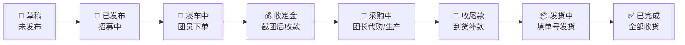
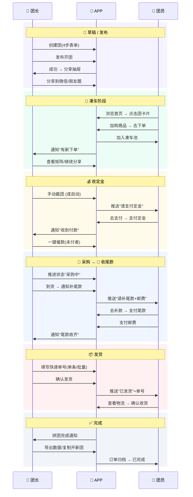

# 追光体APP 全流程卡片视图

---

## 一、团的生命周期状态卡

---

## 二、团长视角 — 各阶段卡片

### 📝 草稿（未发布）

| 项目 | 说明 |
|------|------|
| **入口** | 我的 → 草稿箱 / +号 → 草稿 |
| **状态** | 未发布，仅团长可见 |
| **可操作** | 继续编辑 · 删除 · 发布 |
| **显示信息** | 团名 · 创建时间 · 商品数 · 编辑进度 |

---

### 📢 已发布 · 招募中

| 项目 | 说明 |
|------|------|
| **触发** | 团长点击"发布开团" |
| **状态** | 公开可见，等待团员浏览和加购 |
| **可操作** | 分享(微信/海报/链接) · 编辑团信息 · 编辑商品 · 查看浏览数 |
| **显示信息** | 团名 · 商品数 · 浏览量 · 0人参团 · 截团倒计时 |
| **团员看到** | 首页卡片（招募中标签） · 可浏览详情 · 可加购 |

---

### 🚗 凑车中

| 项目 | 说明 |
|------|------|
| **触发** | 第一个团员下单（加入凑车池） |
| **状态** | 团员陆续下单占位，等待满行或截团 |
| **团长可操作** | 查看矩阵排单 · 催人参团 · 手动截团 · 继续分享 |
| **团员可操作** | 加购/修改数量 · 查看排位 · 取消参团 |
| **显示信息** | 参团人数/目标 · 进度条 · 截团倒计时 · 矩阵排单 |
| **自动事件** | 到截团时间自动推进到"收定金" |

---

### 💰 收定金（截团后）

| 项目 | 说明 |
|------|------|
| **触发** | 手动截团 或 截团时间到 |
| **状态** | 不再接受新下单，等待已下单团员支付定金 |
| **团长可操作** | 一键催定金 · 查看付款进度 · 踢除未付款 · 设置付款截止时间 |
| **团员可操作** | 支付定金 · 查看金额明细 · 修改地址 |
| **显示信息** | 已付/未付人数 · 收款金额/待收金额 · 付款截止倒计时 |
| **自动事件** | 15分钟未支付可自动取消订单 |
| **推送** | 团员收到"请支付定金"通知 |

---

### 🛒 采购中

| 项目 | 说明 |
|------|------|
| **触发** | 团长确认定金收齐，开始采购/生产 |
| **状态** | 团长代购或联系工厂，团员等待 |
| **团长可操作** | 更新采购进度 · 上传凭证图 · 推进到下一阶段 |
| **团员可操作** | 查看进度 · 联系团长 |
| **显示信息** | 当前阶段说明 · 预计到货时间 · 团长更新记录 |

---

### 💸 收尾款（到货后）

| 项目 | 说明 |
|------|------|
| **触发** | 商品到货，团长通知补尾款 |
| **状态** | 等待团员支付剩余款项(尾款+邮费) |
| **团长可操作** | 一键催尾款 · 一键催邮费 · 查看收款进度 · 设置补款截止 |
| **团员可操作** | 支付尾款 · 支付邮费 · 确认/修改地址 |
| **显示信息** | 已付/未付尾款人数 · 邮费收取进度 · 补款截止时间 |
| **推送** | 团员收到"请补尾款/邮费"通知 |

---

### 📦 发货中

| 项目 | 说明 |
|------|------|
| **触发** | 团长开始填写快递单号 |
| **状态** | 逐批发货，团员等待收货 |
| **团长可操作** | 填写单号(单条/批量CSV) · 标记已发货 · 查看发货进度 |
| **团员可操作** | 查看物流 · 复制单号 · 催发货 · 确认收货 |
| **显示信息** | 已发/未发件数 · 快递单号 · 物流状态 |
| **推送** | 团员收到"已发货"通知+单号 |

---

### ✅ 已完成

| 项目 | 说明 |
|------|------|
| **触发** | 全部团员确认收货 |
| **状态** | 拼团结束 |
| **团长可操作** | 导出数据 · 查看统计 · 复制开新团 |
| **团员可操作** | 查看订单记录 · 评价 |
| **显示信息** | 总参团人数 · 总收款 · 完成时间 |

---

## 三、团员视角 — 我的订单状态卡

### 🚗 凑车中

| 项目 | 说明 |
|------|------|
| **含义** | 我已下单占位，等待截团 |
| **可操作** | 查看排位 · 修改数量 · 取消参团 |
| **显示** | 团名 · 我的商品 · 排位号 · 截团倒计时 |

---

### 💳 待支付

| 项目 | 说明 |
|------|------|
| **含义** | 截团了，需要付定金/全款 |
| **可操作** | 去支付 · 查看金额 · 修改地址 |
| **显示** | 应付金额 · 付款截止时间 · 支付按钮 |
| **紧急度** | 高（橙色高亮） |

---

### 💸 待补款

| 项目 | 说明 |
|------|------|
| **含义** | 需要补尾款或邮费 |
| **可操作** | 去补款 · 查看明细 |
| **显示** | 尾款金额 · 邮费金额 · 补款截止 |
| **紧急度** | 高（红色高亮） |

---

### 📦 待发货

| 项目 | 说明 |
|------|------|
| **含义** | 款已付清，等团长发货 |
| **可操作** | 修改地址 · 催发货 · 联系团长 |
| **显示** | 团长发货进度 · 预计发货时间 |

---

### 🚚 待收货

| 项目 | 说明 |
|------|------|
| **含义** | 已发货，在路上 |
| **可操作** | 查看物流 · 复制单号 · 确认收货 |
| **显示** | 快递公司 · 单号 · 物流状态 |

---

### ✅ 已完成

| 项目 | 说明 |
|------|------|
| **含义** | 已确认收货 |
| **可操作** | 查看详情 · 评价 · 再次参团 |
| **显示** | 完成时间 · 商品信息 · 支付总额 |

---

## 四、双视角并行时序图

---

## 五、页面路由 × 状态映射

| 团状态 | 团长操作页面 | 团员操作页面 |
|--------|------------|------------|
| 草稿(未发布) | `/create-group` (继续编辑) | — |
| 已发布·招募中 | `/group/[id]?view=leader` → 分享/编辑 | 首页卡片 → `/group/[id]?view=member` |
| 凑车中 | `/group/matrix` 查看排单 | `/group/[id]` 加购 → 矩阵 |
| 收定金 | `/orders/in-progress` 催款 | `/order/pay` 支付定金 |
| 采购中 | `/group/[id]` 推进状态 | `/member/orders-ongoing` 查看进度 |
| 收尾款 | `/orders/in-progress` 催尾款 | `/order/pay?kind=finalPay` |
| 发货中 | `/group/shipping` 填单号 | `/member/orders-to-ship` 催发货 |
| 已发货 | `/group/shipping` 查看进度 | `/member/orders-to-receive` 查物流 |
| 已完成 | `/group/[id]` 导出/复制 | `/member/orders-ongoing?filter=done` |

---

## 六、关键交互节点

| 节点 | 触发条件 | 推送对象 | 推送内容 |
|------|---------|---------|---------|
| 新人下单 | 团员点击"去下单" | 团长 | "XXX 加入了你的团" |
| 截团 | 手动/倒计时到 | 全部团员 | "已截团，请在X分钟内支付" |
| 催定金 | 团长点击催款 | 未付款团员 | "请尽快支付定金 ¥XX" |
| 定金到账 | 团员支付成功 | 团长 | "收到 XXX 定金 ¥XX" |
| 催尾款 | 团长点击催款 | 未补款团员 | "请补尾款 ¥XX" |
| 尾款到账 | 团员支付成功 | 团长 | "收到 XXX 尾款 ¥XX" |
| 已发货 | 团长填写单号 | 对应团员 | "已发货，单号: XXXXX" |
| 确认收货 | 团员点击确认 | 团长 | "XXX 已确认收货" |
| 全部完成 | 最后一人确认 | 团长 | "🎉 拼团圆满完成！" |
